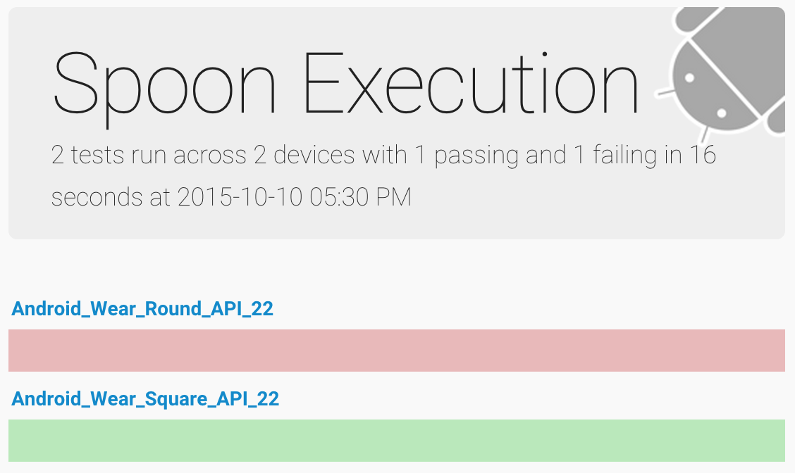

Espresso Watch
==============

Testing espresso on an android wear watch app.

The app has a blank wear activity with the default text 'hello round world' or 'hello square world' text on the layout file for the appropriate screen shape.

A single espresso test case verifies that the text matches 'hello square world' - thus, it passes on square watches and fails on round ones.

# Run with Spoon

[Spoon](http://square.github.io/spoon/) lets you run tests on multiple devices simultaneously.

`java -jar spoon-runner-1.2.0-jar-with-dependencies.jar --apk app/build/outputs/apk/app-debug.apk --test-apk app/build/outputs/apk/app-debug-androidTest-unaligned.apk`

# Notes

To turn off system animations and avoid flakiness/this error:

`android.support.test.espresso.NoActivityResumedException: No activities in stage RESUMED. Did you forget to launch the activity. (test.getActivity() or similar)?`

Uncomment this line in the manifest so the app will request the permission (this could be a separate build flavor so it doesn't touch the real app, but for the purposes of this demo it doesn't seem worth it):

`<!--<uses-permission android:name="android.permission.SET_ANIMATION_SCALE" />-->`

Then run this script:

`./set_animation_permissions.sh com.emmaguy.espressowatch`